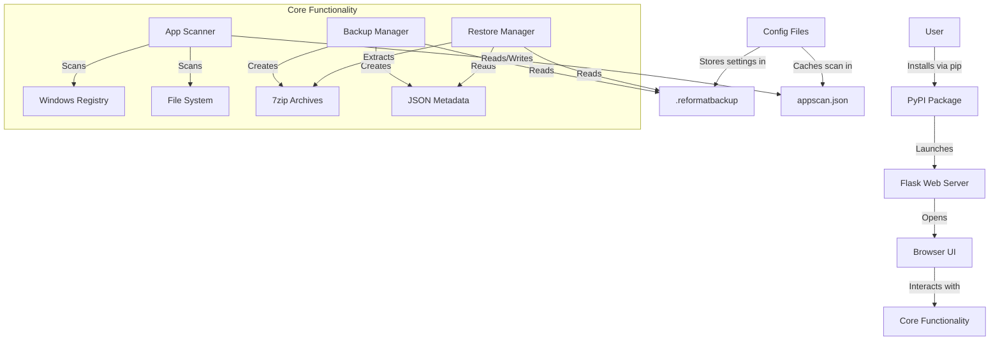
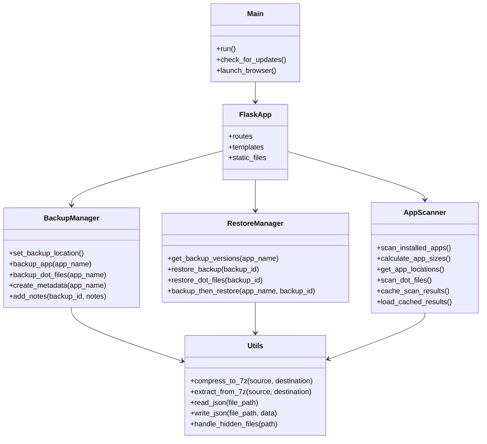

# ReformatBackup - Project Plan

## Project Overview

ReformatBackup is a Python-based Flask application designed to simplify the backup and restoration of application-specific user settings and data on Windows 11. It provides a modern web interface for users to manage app backups and restores, with features like auto-updates, themeable UI, and robust backup/restore functionality with metadata and notes.

## Architecture Diagram



## Epics and Stories

### Epic 1: Project Setup and Infrastructure
- [x] **Story 1.1**: Initialize project structure
  - [x] Create directory structure following coding guidelines
  - [x] Set up Git repository
  - [x] Create initial README.md
  - [x] Set up .gitignore file

- [x] **Story 1.2**: Configure package for PyPI distribution
  - [x] Create pyproject.toml with metadata and dependencies
  - [x] Define command-line entry point
  - [x] Set up version management

- [x] **Story 1.3**: Establish development environment
  - [x] Create requirements.txt for development dependencies
  - [x] Set up linting with flake8
  - [x] Configure testing with pytest

### Epic 2: Core Application Framework
- [x] **Story 2.1**: Implement Flask application structure
  - [x] Create main application entry point
  - [x] Set up Flask server configuration
  - [x] Implement browser launch functionality
  - [x] Create base template with theme support

- [x] **Story 2.2**: Develop configuration management
  - [x] Implement .reformatbackup file handling
  - [x] Create utility functions for reading/writing configuration
  - [x] Add backup location management

- [x] **Story 2.3**: Create auto-update functionality
  - [x] Implement version checking against PyPI
  - [x] Add update notification in UI
  - [x] Develop one-click update mechanism

### Epic 3: Application Scanning
- [x] **Story 3.1**: Implement Windows application scanning
  - [x] Develop Registry scanning using winreg
  - [x] Add file system scanning for installed applications
  - [x] Implement size calculation for applications
  - [x] Add detection of application-specific dot files/directories in user home

- [x] **Story 3.2**: Create scan caching mechanism
  - [x] Implement appscan.json file structure
  - [x] Add functions to read/write cache
  - [x] Create rescan functionality (flag and UI toggle)
  - [x] Include dot files/directories information in cache

- [x] **Story 3.3**: Develop application data display
  - [x] Create UI components for app listing
  - [x] Implement sorting and filtering
  - [x] Add size summaries per drive and total

### Epic 4: Backup Functionality
- [x] **Story 4.1**: Implement backup location management
  - [x] Create UI for setting backup location
  - [x] Develop storage of location in .reformatbackup
  - [x] Add validation and error handling

- [x] **Story 4.2**: Develop application backup logic
  - [x] Implement identification of app data locations
  - [x] Create functions to gather app data for backup
  - [x] Add progress tracking and reporting
  - [x] Include handling of dot files/directories in user home

- [x] **Story 4.3**: Implement 7zip compression
  - [x] Integrate py7zr library
  - [x] Create compression utility functions
  - [x] Implement naming convention with timestamps
  - [x] Ensure proper handling of hidden files during compression

- [x] **Story 4.4**: Develop backup metadata
  - [x] Create JSON structure for backup metadata
  - [x] Implement notes functionality
  - [x] Add metadata storage alongside backups

### Epic 5: Restore Functionality
- [x] **Story 5.1**: Implement backup version management
  - [x] Create UI for displaying backup versions
  - [x] Develop functions to list available backups
  - [x] Add metadata display for backups

- [x] **Story 5.2**: Develop restore options
  - [x] Implement direct restore functionality
  - [x] Create backup-then-restore workflow
  - [x] Add confirmation and warning dialogs
  - [x] Include options for handling existing dot files/directories

- [x] **Story 5.3**: Implement restore process
  - [x] Develop extraction of 7zip archives
  - [x] Create functions to place files in correct locations
  - [x] Add progress tracking and reporting
  - [x] Ensure proper restoration of hidden files with correct permissions

### Epic 6: User Interface
- [x] **Story 6.1**: Develop base UI framework
  - [x] Create responsive layout with Bootstrap/Tailwind
  - [x] Implement light/dark theme support
  - [x] Add theme toggle functionality

- [x] **Story 6.2**: Implement application list UI
  - [x] Create app list with checkboxes
  - [x] Add size and location display
  - [x] Implement last backup date indication

- [x] **Story 6.3**: Develop backup UI components
  - [x] Create backup location input
  - [x] Implement app selection controls
  - [x] Add backup button and progress indicators

- [x] **Story 6.4**: Implement restore UI components
  - [x] Create version selection dropdown/list
  - [x] Add restore option buttons
  - [x] Implement notes editing interface

- [x] **Story 6.5**: Develop feedback and notification system
  - [x] Create toast/notification component
  - [x] Implement progress bars for operations
  - [x] Add error message display

### Epic 7: Testing and Quality Assurance
- [ ] **Story 7.1**: Implement unit testing
  - [ ] Create tests for core functionality
  - [ ] Add tests for backup/restore logic
  - [ ] Implement UI component tests

- [ ] **Story 7.2**: Develop integration testing
  - [ ] Create end-to-end tests for main workflows
  - [ ] Implement mock system for Windows API testing
  - [ ] Add test coverage reporting

- [ ] **Story 7.3**: Perform error handling and edge cases
  - [ ] Implement comprehensive error handling
  - [ ] Add validation for user inputs
  - [ ] Create graceful fallbacks for failure scenarios
  - [ ] Handle permission issues with hidden files/directories

### Epic 8: Documentation and Deployment
- [ ] **Story 8.1**: Create user documentation
  - [ ] Write installation instructions
  - [ ] Create usage guide with screenshots
  - [ ] Add troubleshooting section
  - [ ] Document handling of dot files/directories

- [ ] **Story 8.2**: Develop developer documentation
  - [ ] Document code architecture
  - [ ] Create API documentation
  - [ ] Add development setup guide

- [ ] **Story 8.3**: Prepare PyPI deployment
  - [ ] Finalize package configuration
  - [ ] Create release process
  - [ ] Implement version tagging

## Technical Architecture

### Component Structure



### File Structure

```
reformatbackup/
├── src/
│   ├── __init__.py
│   ├── main.py             # Entry point, Flask setup
│   ├── scan.py             # App scanning logic
│   ├── backup.py           # Backup functionality
│   ├── restore.py          # Restore functionality
│   ├── utils.py            # Helpers (JSON, 7zip)
│   └── routes.py           # Flask routes
├── templates/
│   ├── base.html           # Base template with theme toggle
│   ├── index.html          # Main app list view
│   ├── backup.html         # Backup interface
│   └── restore.html        # Restore interface
├── static/
│   ├── css/
│   │   ├── styles.css      # Main styles
│   │   └── themes.css      # Theme definitions
│   ├── js/
│   │   ├── app.js          # Main UI logic
│   │   ├── backup.js       # Backup functionality
│   │   ├── restore.js      # Restore functionality
│   │   └── theme.js        # Theme switching
│   └── img/
│       └── logo.png        # App logo
├── tests/
│   ├── test_scan.py
│   ├── test_backup.py
│   ├── test_restore.py
│   └── test_utils.py
├── pyproject.toml          # Package config
├── README.md
└── LICENSE
```

## Development Workflow

1. **Setup Phase**:
   - Initialize project structure
   - Configure package for PyPI
   - Set up development environment

2. **Core Development**:
   - Implement Flask application framework
   - Develop Windows app scanning
   - Create backup/restore functionality
   - Build user interface components

3. **Testing Phase**:
   - Write and run unit tests
   - Perform integration testing
   - Test on different Windows 11 configurations

4. **Documentation and Deployment**:
   - Create comprehensive documentation
   - Prepare for PyPI deployment
   - Release initial version

## Testing Strategy

- **Unit Testing**: Test individual components in isolation
- **Integration Testing**: Test interactions between components
- **UI Testing**: Verify UI functionality and responsiveness
- **Edge Case Testing**: Test error handling and unusual scenarios
- **Mock Testing**: Use mocks for Windows API interactions

## Deployment Plan

1. **Package Preparation**:
   - Finalize pyproject.toml configuration
   - Ensure all dependencies are correctly specified
   - Verify entry point functionality

2. **PyPI Deployment**:
   - Build distribution package
   - Upload to PyPI
   - Verify installation process

3. **Post-Deployment**:
   - Monitor for issues
   - Gather user feedback
   - Plan for updates and improvements